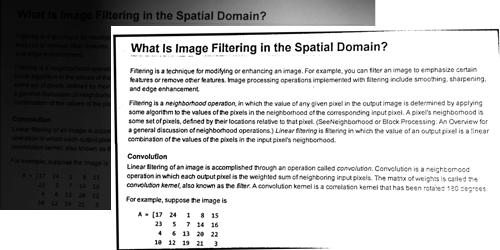

<p align="center"></p>

The OCRImageOptimizer optimizes images for OCR readers for improved text recognition. The application supports automatic image rotation, color binarization (black and white), removing shadows from scans, blurr reduction and cropping of areas which are not part of the scanned/photographed paper.

With Karaka you have one partner who can provide all the tools and software solutions you are used to at fair and reasonable prices even for small organizations and companies/startups. Our solutions can be used independently from each other or fully integrated with other solutions we provide. By choosing Karaka as your partner you'll be able to adjust your software based on the changes in your requirements without worrying about integration and workflow optimization.

## Dependencies

* Windows 7 or newer
* tesseract-ocr (or other) for text recognition
* pdftoppm (or other) for pdf to image export if your scans are pdf

### Developer tools

* Language: C++
* Libraries: opencv
* Tools: CMake or Visual Studio

## Installation

Simply download the .exe and you can run the program

## Usage

The default usage to automatically run all possible optimizations is:

```sh
OCRImageOptimizerApp.exe -i <INPUT_IMAGE> -o <OUTPUT_IMAGE>
```

### Arguments

* `-h` Show help
* `-i` Input image
* `-o` Output image
* `--rotate` Tries to automatically fix the image rotation
* `--edges` Tries to automatically detect and remove irrelevant parts from the image
* `--binary` Tries to turn the image purely into black and white and remove shadows

## Images

<p align="center"></p>

## Legal

* [Terms of Service](https://jingga.app/en/terms)
* [License](https://github.com/Karaka-Management/OCRImageOptimizerApp/blob/master/LICENSE.txt)

### Disclaimer

You can use the demo application for some tests in order to see if the software fulfills your needs.

> The demo application prints a water mark on the image.
